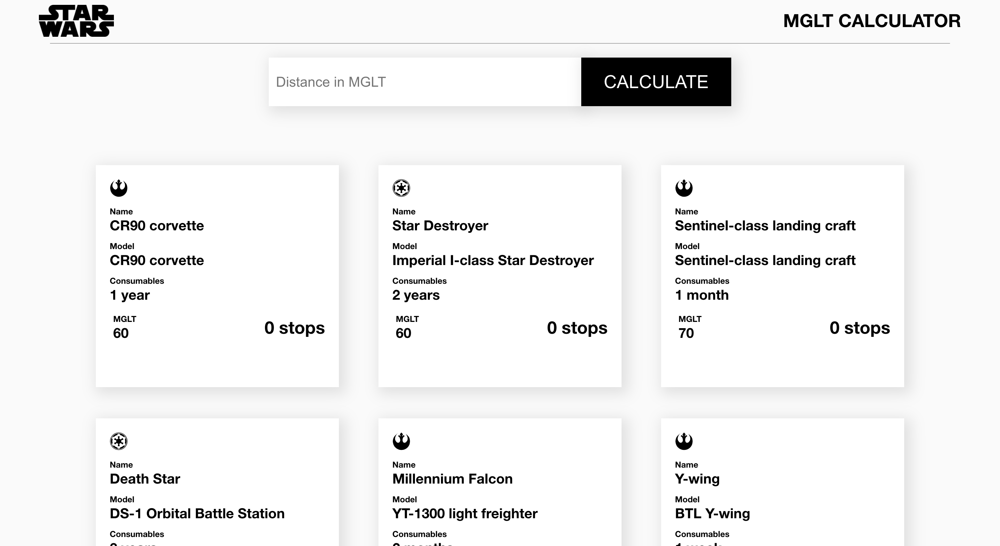

# MGLT Calculator
## Sobre o projeto
Este projeto foi realizado para solucionar o desafio técnico da nata.house para a vaga de Desenvolvedor Javascript.
Veja a descrição completa do desafio [aqui](https://www.notion.so/Technical-test-nata-house-b41bd08b949d4cf194a18322b28bf09b).





## Proposta
O desafio consiste em desenvolver, utilizando Javascript, uma pagina web que se conecte a [Swapi](https://swapi.dev/) (Star Wars API) e permita o calculo do número de paradas necessárias para que as naves da saga percorram uma certa distancia em Megalights (MGLT), provida pelo usuário.

## Cálculo
Megalights é uma unidade de distancia utilizada na saga Star Wars e permite medir a diferença na velocidade das naves se deslocando no espaço. Com o banco de naves da SWAPI, podemos utilizar as informações de MGLT/hora nos cálculos. 
O calculo em si consiste em algumas etapas: 

* Transformar a capacidade de carga das naves da unidade padrão do dado para horas.
* Dividir a distancia provida pelo usuario pela velocidade da nave em MGLT/hora
* Dividir o resultado acima pela capacidade de carga em horas calculada no primeiro passo
* O resultado final é o piso desse cálculo.

## Instalação
Clone o repositório abaixo:


```
https://github.com/ThiagoHenriqueCastro/MGLT-Calculator.git
```

Para pegar as bibliotecas:

```
$ yarn add
# ou 
$ npm install
```

Para rodar:
```
$ yarn start
# ou 
$ npm start
```

### Bibliotecas utilizadas
* Axios - Requisitar os dados da api
* Moment - Calcular o abastecimento das naves em horas
* Redux & React Redux - Global State do app
* Redux Persist - Persistir os dados em localstorage
* Styled Components -  Estilização dos componentes
* React Icons - Icones do app
* React Lottie - Animações JSON na aplicação

## Estrutura 
```
src/
	- components/
		- index.js
	- containers/
	- fixtures/
	- pages/
		- index.js
	- redux/
	- services/
	- utils/
```

### Services
Na pasta services estão as funções auxiliares, bem como a definição da api.

### Utils
Auxilia nos calculos.

### Fixtures
Nessa pasta estão os arquivos de mock data